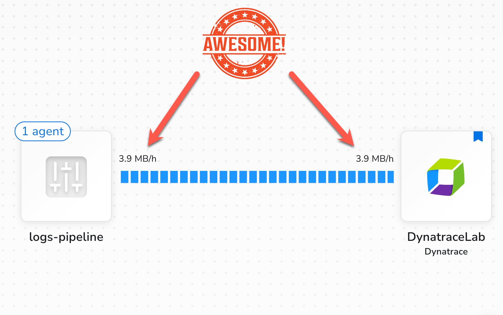

<!-- markdownlint-disable-next-line -->
#  Log Pipelines with Bindplane

---

## Lab Overview

During this hands-on training, you will install and configure Bindplane to collect logs from a Linux host, shape them in-flight using processors and routers, and deliver them to Dynatrace, where OpenPipeline takes over to parse and shape them.

**Lab tasks:**

1. **Getting Started**
   - Create a Bindplane account and project
   - Generate a Dynatrace platform token with `logs.ingest` and `metrics.ingest` permissions
   - Launch the lab environment using GitHub Codespaces or a local Dev Container

2. **Install the Bindplane Agent**
   - Run the Bindplane-generated installation command on the lab host
   - Confirm the agent appears in the Bindplane UI

3. **Create a Bindplane Configuration**
   - Define a File source pointed at the host's syslog
   - Configure a Dynatrace destination using your environment ID and token
   - Assign the agent to the configuration and verify data flowing in the pipeline overview

4. **Add Fields with a Processor**
   - Use the live log preview in Bindplane to inspect in-flight records
   - Apply an *Add Fields* transform processor to tag every log with a `project` attribute
   - Roll out the configuration change and confirm the new field appears in Dynatrace Logs

5. **Parse Logs with Dynatrace OpenPipeline**
   - Create an OpenPipeline logs pipeline using the Syslog technology bundle
   - Tune the processor matching condition to align with the lab's log file path
   - Route logs to the pipeline using a dynamic route keyed on the `project` field
   - Verify raw syslog content is now fully parsed into discrete, queryable fields

6. **Mask Sensitive Data & Route Selectively**
   - Identify plaintext credentials leaking through syslog audit logs
   - Add a Bindplane *Redact Sensitive Data* processor with custom regex rules and a hashing strategy
   - Insert a Bindplane router to limit redaction to only credential-bearing logs
   - Confirm hashed values replace the originals in Dynatrace

7. **Extract Metrics from Logs**
   - Generate counter metrics from structured log data using OpenPipeline metric extraction

8. **Monitor Bindplane Health**
   - Observe the health of your Bindplane infrastructure using Self-Monitoring (SFM)

Ready to build a log pipeline?

## 🚀 Open the lab

[https://dynatrace-wwse.github.io/enablement-bindplane-logs](https://dynatrace-wwse.github.io/enablement-bindplane-logs)
