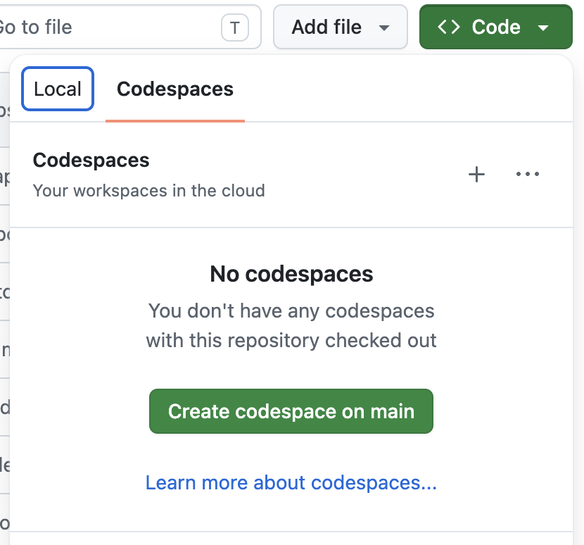
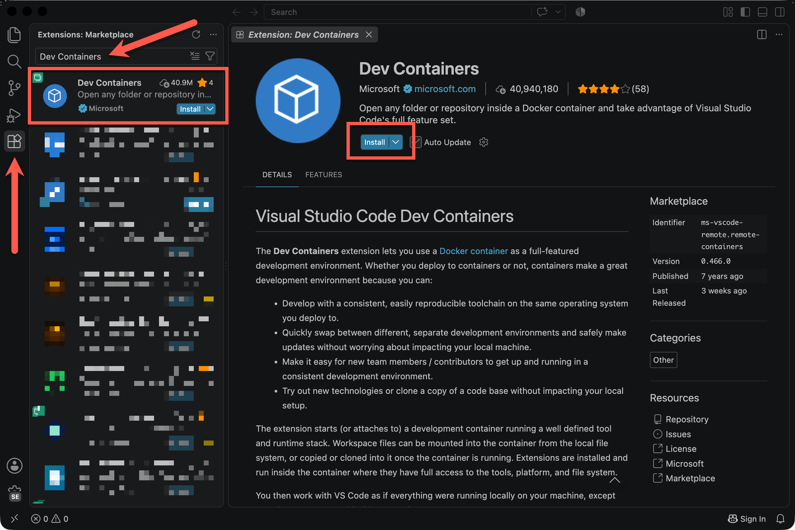
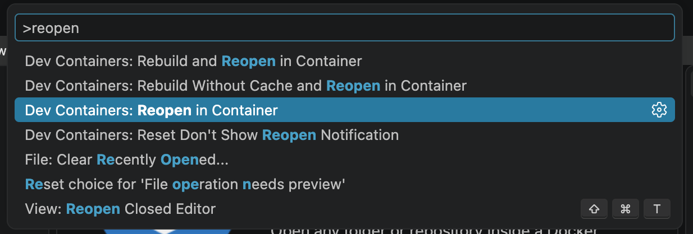
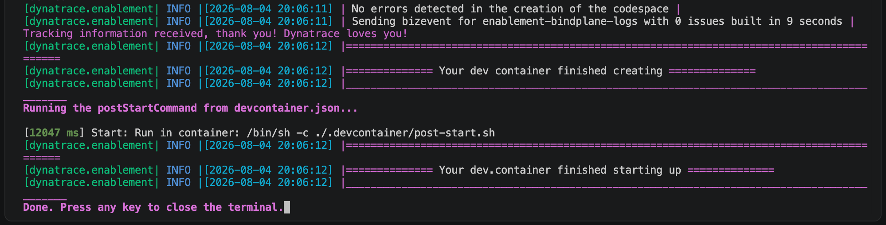
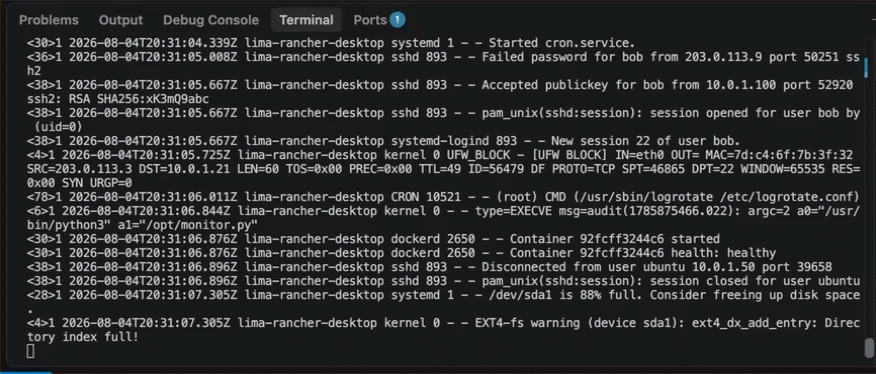

Before you can start building your log pipeline, you need three things in place: a Bindplane account to manage your pipeline configuration, a Dynatrace tenant to receive the data, and a development environment to run the lab in.

**Bindplane** is a telemetry pipeline management platform built on OpenTelemetry. You'll use it to install and remotely configure the agent that runs on your lab host. If you don't already have an account, you can sign up for free at [bindplane.com](https://bindplane.com/).

**Dynatrace** is where your logs and metrics will ultimately land. The lab needs a platform token scoped ingesting logs and metrics (detailed below). Everything else in Dynatrace (querying, dashboards, notebooks) works with your existing permissions.

The **development environment** is a pre-configured Linux host packaged as a [Dev Container](https://containers.dev/). You can run it entirely in your browser via GitHub Codespaces, or locally in VSCode with Docker.

## 1. Bindplane

Begin by creating a [Bindplane](https://bindplane.com/) account, then create a project to work in.

## 2. Dynatrace

In your Dynatrace tenant, [create a platform token](https://docs.dynatrace.com/docs/manage/identity-access-management/access-tokens-and-oauth-clients/platform-tokens) that has the following permissions:

- storage:logs:write
- openpipeline:logs:ingest
- storage:metrics:write
- openpipeline:metrics:ingest

Save the token for now; you won't be able to see it again once you leave the token creation dialog.

## 3. Development Environment
The lab work will be done inside a [Dev Container](https://containers.dev/) - a fully configured development environment that is bootstrapped with all of the dependencies required for the lab.

You have two options to work with the Dev Container:

### A. GitHub Codespace
This is the lowest-friction way to get up and running.  You can simply launch a browser-based session of VSCode without having to install anything locally

!!! warning "Codespaces Quota"
    GitHub Codespaces are a billed resource, however GitHub provides a free monthly quota.  If you would rather not incur any charges against your quota for this lab, use option #2

1. Visit this [repository's page in GitHub](https://github.com/dynatrace-wwse/enablement-bindplane-logs)
2. Expand the "<> Code" menu
3. Click "Create codespace on main"
{: style="width: 400px;"}

### B. Local Dev Container
Working with a local Dev Container involves an integration with your IDE. Visual Studio Code (VSCode) is well-suited for this
This overall process is described in the [Visual Studio Code documentation](https://code.visualstudio.com/docs/devcontainers/containers).

In summary:

1. Install Docker.
2. Install VSCode.
3. Install the official Dev Containers extension.

4. Clone this repo and open it up in VSCode
5. Use the VSCode [Command Palette](https://code.visualstudio.com/docs/editing/userinterface#_command-palette) to Select "Dev Containers: Reopen in Container"



## Validate the Environment
We'll be doing all of our work inside this Dev Container.  Take a look at the terminal tab at the bottom of your VSCode window.  You should see some messages confirming that the environment has started up correctly.


Press any key or open a new terminal window to continue.

This host writes its logs to files in `/var/log/bpsystem`.  Navigate to that directory and view the contents

```
> cd /var/log/bpsystem
> ls
auth.log  cron.log  kern.log  syslog
```

Let's take a look at the logs being written to syslog by tailing the syslog file
```
> tail -f syslog
```


Your logs may look slightly different based on some environmental factors like hostname or docker implementation.

Great!  With that, your environment is set up and ready to go!

<div class="grid cards" markdown>
- [Let's install our Bindplane Agent :octicons-arrow-right-24:](3-bindplane-agent.md)
</div>
