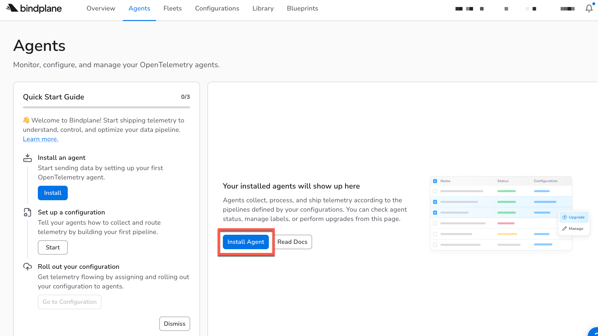
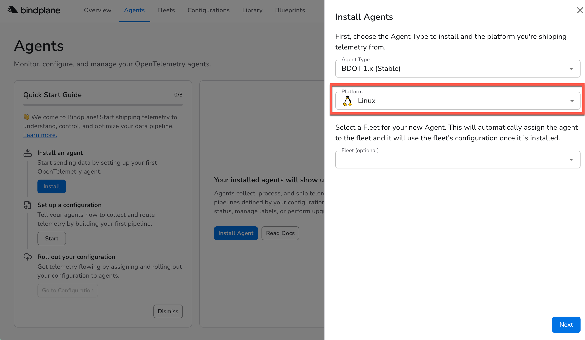
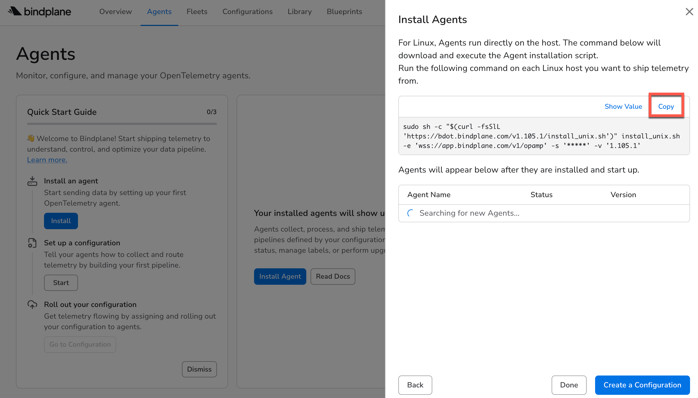
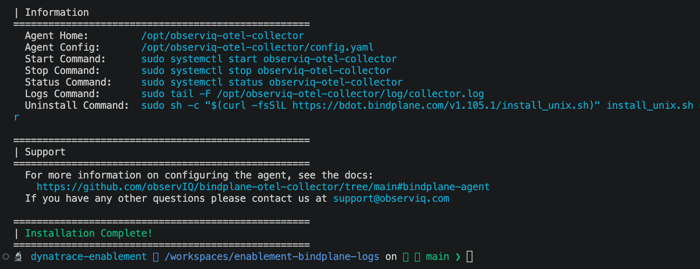
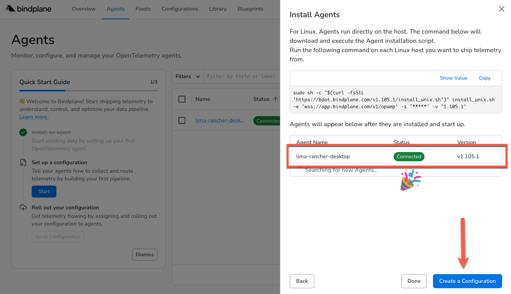

The **Bindplane Agent** is the component that runs on a host and collects telemetry. Its Bindplane's distribution of the OpenTelemetry Collector which is purpose-built for managed deployment. This means Bindplane can push configuration changes to it remotely via the OpAmp protocol, without you ever touching the host directly.

Once the agent is running and visible in the Bindplane UI, you're ready to tell it what to collect and where to send it.

### 1. Navigate to your Bindplane account
Click the button "Install Agent"


### 2. Specify your agent configuration
You can use the default, stable Agent Type.

You can leave "Fleet" blank.

Choose **Linux** for the platform and click "Next"



### Install the agent
You'll be shown a command that installs the agent.  Copy it and run it in your terminal.



You should see some text scroll by, and a message indicating that the Bindplane agent was installed.



You may see some messages instructing you to use `systemctl` to start the Bindplane service.  DON'T DO THAT!  In this environment, you have a command called `startBindplane` instead.  Go ahead and run that in your terminal.

```
> startBindplane
```

!!! warning "Bindplane Startup"
    Don't use the `systemctl` command to start Bindplane as the installation script mentions.  Instead, use the `startBindplane` command available in your terminal.

Once you've run that command, you should see your agent show up in the Bindplane UI.  It will be named after the host it is installed on.  If you are using a Codespace, it will be your Codespace name.  If you are using a local Dev Container, it will take the name of your Docker implementation.



Go ahead and click "Create a Configuration" and we'll start ingesting some logs!

<div class="grid cards" markdown>
- [Create Configuration :octicons-arrow-right-24:](4-bindplane-configuration.md)
</div>

