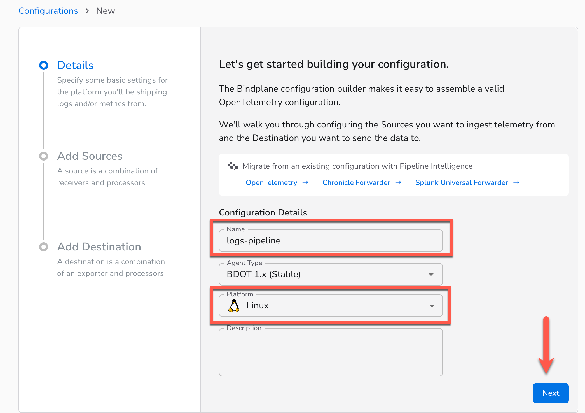
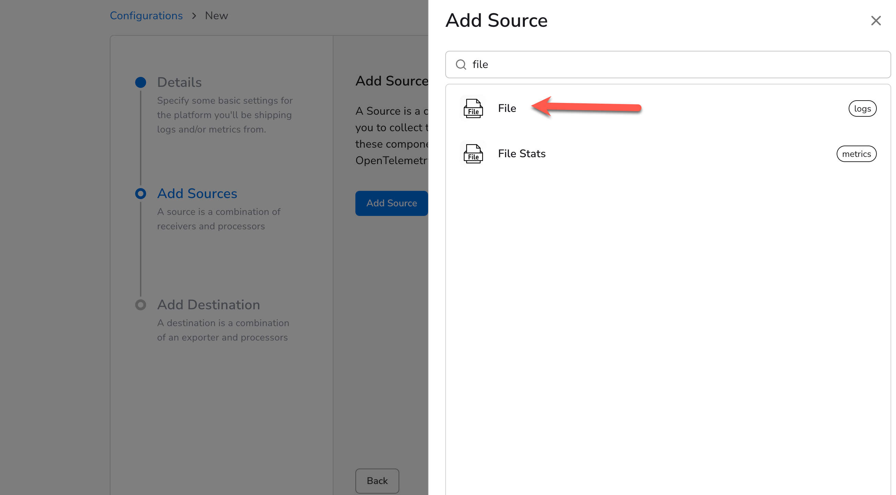
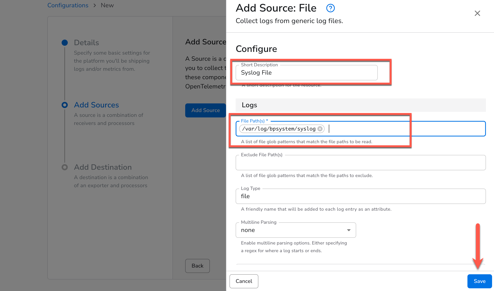
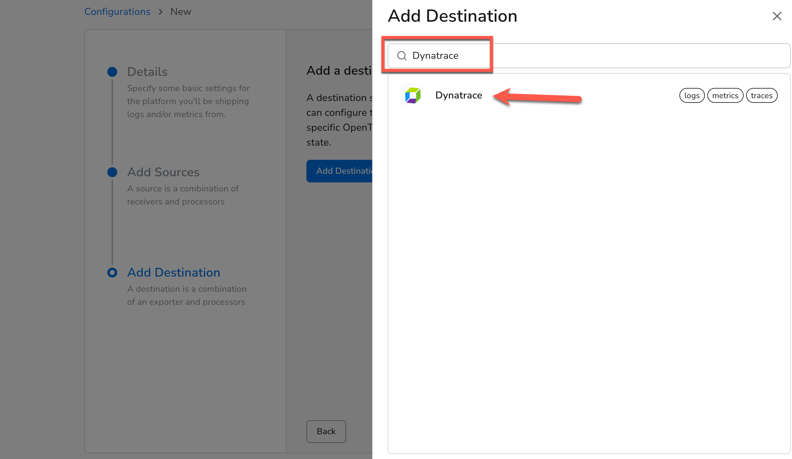
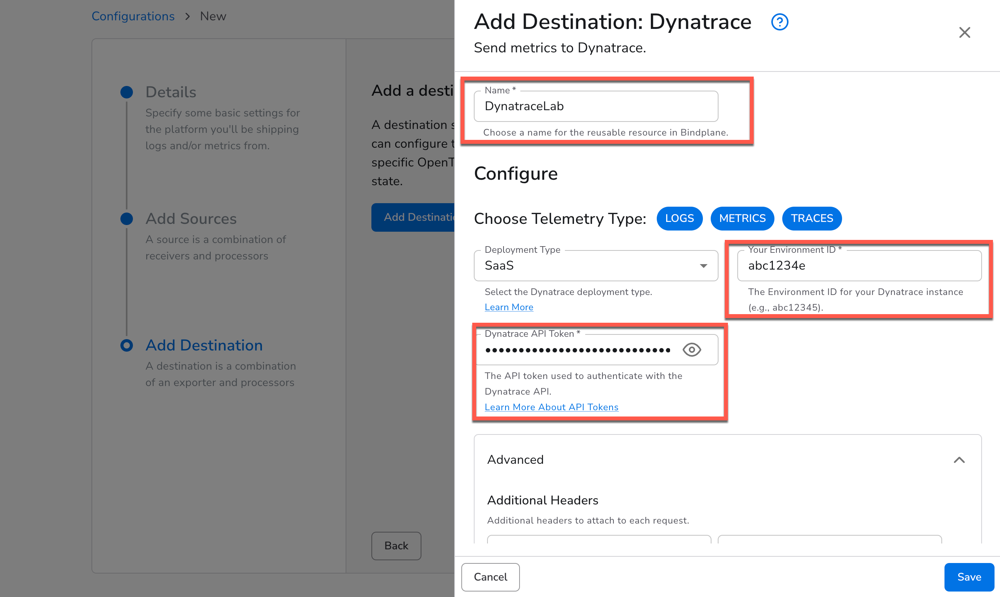
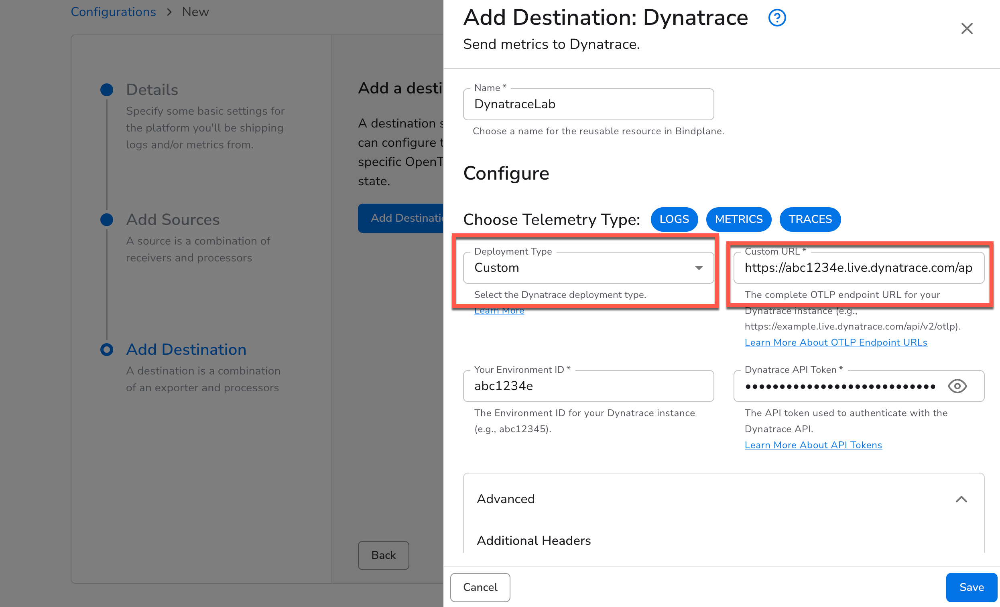
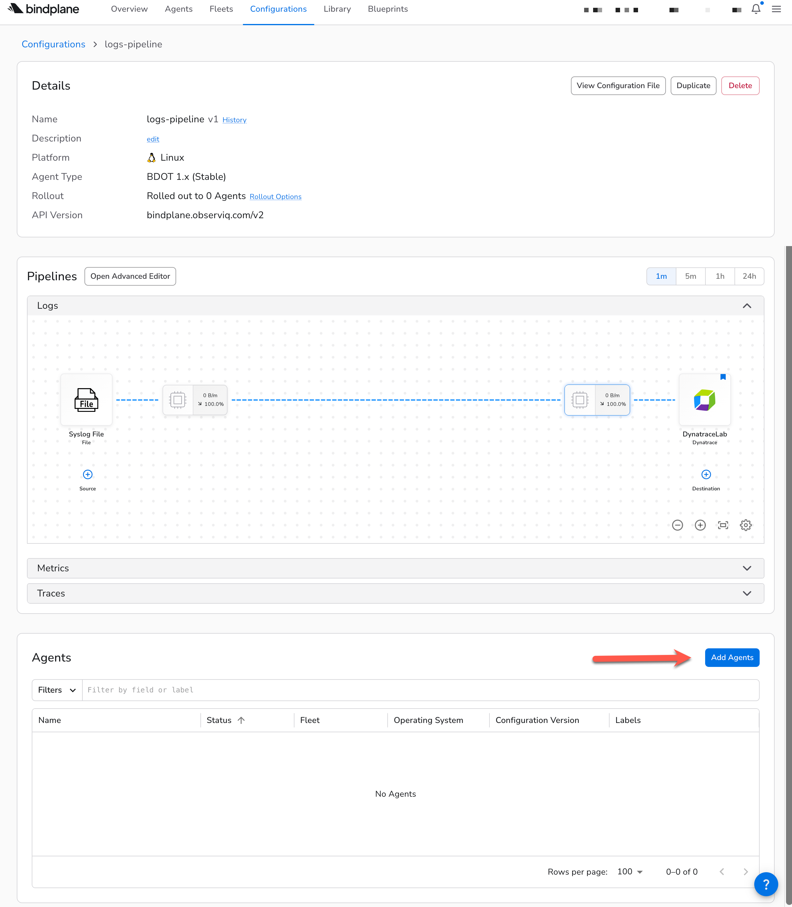
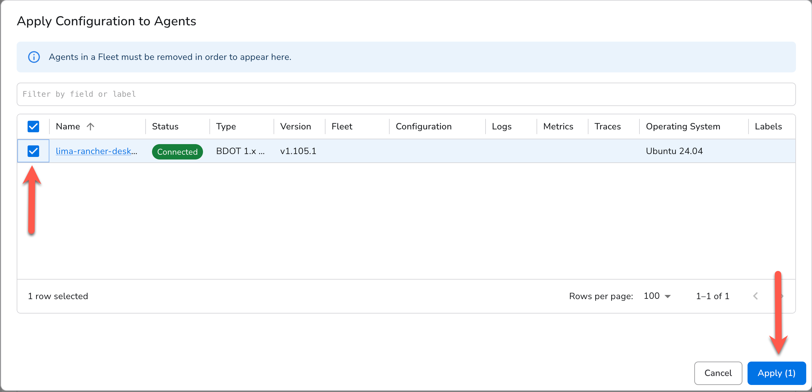
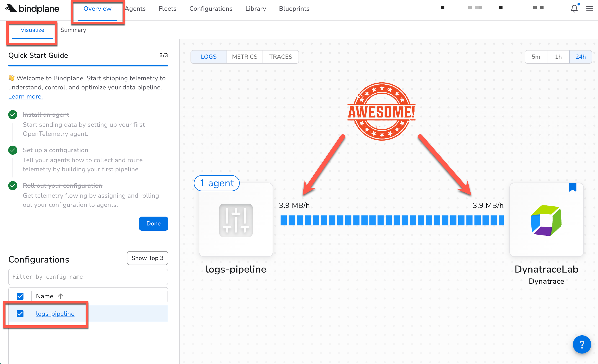
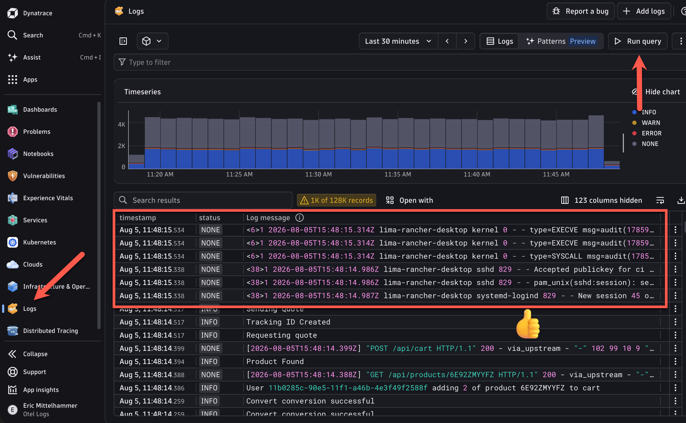

A Bindplane **Configuration** is a reusable, version-controlled definition of a telemetry pipeline. It describes three things: where data comes from (**Sources**), how it's transformed in-flight (**Processors**), and where it's sent (**Destinations**). Once a configuration is created, it can be deployed to one or many agents with a single rollout, and rolled back just as easily if something goes wrong.

In this section, you'll build your first configuration:

- **Source:** a File source pointed at `/var/log/bpsystem/syslog`, using Bindplane's built-in filelog receiver to tail the syslog file your Dev Container is actively writing to
- **Destination:** the Dynatrace destination, which sends logs over OTLP/HTTP directly to your Dynatrace environment using your environment ID and platform token

Once you assign your agent to the configuration and roll it out, you'll be able to see log throughput in the Bindplane pipeline overview and verify that raw syslog records are appearing in Dynatrace's Logs app.

### 1. Create the configuration
Choose a descriptive name for your configuration, choose **Linux** for the platform, and click "next"


### 2. Create a source
Now we're going to ingest our Syslog logs with a log source. On the following screen, click "Add Source". This will bring up all of the available sources we can choose from.

Use the search box to search for "file", and choose the File source.



### 3. Configure the File source
1. Create a descriptive name, like "Syslog File" for your source
2. Add the Syslog file path that we examined before:  `/var/log/bpsystem/syslog`
3. Click "Next"



### 4. Create a Destination
We need to send our logs somewhere to make use of them.  Let's create a Destination that will send our logs to Dynatrace.

1. Click "Add Destination"
2. Seach for "Dynatrace"
3. Click on the Dynatrace Destination



### 5. Configure the Destination

Have a look at the documentation for Dyntrace's [OTel API](https://docs.dynatrace.com/docs/ingest-from/opentelemetry/otlp-api#base-url) to understand how to structure your endpoint URL.

1. Give this Destination a descriptive name
2. Enter your Dynatrace [Environment Id](https://docs.dynatrace.com/docs/shortlink/monitoring-environment#environment-id) 
3. Enter the token you created for that environment in the [Getting Started](../2-getting-started) section.



Alternatively, you can enter a custom [Dynatrace OTLP endpoint](https://docs.dynatrace.com/docs/ingest-from/opentelemetry/otlp-api#base-url) url by choosing "Custom" in the dropdown:



Click "Save" and you'll be sent to the Configuration you just created.

### 6. View the Configuration and Pipeline

We've created a Bindplane Configuration that can deployed wherever we need to collect and send logs.  You can see the logs pipeline we created, but it's not doing much right now because we haven't told any agents to use it.  Scroll down and you'll see a listing of all the agents using this configuration (none yet!), and a button to "Add Agents".



### 7. Add the Agents to the Configuration

1. Click "Add Agents"
2. In the pop-up dialog, choose the Agent you created earlier
3. Click "Apply"



### 8. View the Data Flow

Now let's check to see that data is flowing in our pipeline

1. Click "Overview" in the top navigation bar.  You should be defaulted to the "Visualize" sub-tab.
2. See the visualization of your pipeline on the right.  You should see that your pipeline is shipping data to Dynatrace by viewing the MB/h.  Great job!

Once you're done, navigate back to your configuration.



### 9. View Logs in Dynatrace

Now let's verify that we're seeing the logs in Dynatrace.

1. Visit your Dynatrace environment and open the "Logs" app from the left-hand navigation (or search for it by using the search function in the top-left)
2. Click the "Run Query" button to fetch the latest logs from your environment.
3. View the results.  You might have a mix of logs from all places in this view since this is *everything* in your environment.  The syslogs for this lab can be identified by starting with a number enclosed in `<` and `>`, followed by a timestamp, followed by the hostname of your Dev Container (which should match the agent name we created earlier).

Example:
```
<6>1 2026-08-05T15:48:17.953Z lima-rancher-desktop ...
```

If you have so many logs streaming in that they may have been pushed out of the resultset, search for your Dev Container hostname using the filter bar at the top of the screen.



Now, let's put Bindplane and Dynatrace to work to make these logs more useful!

<div class="grid cards" markdown>
- [Add a field using a Bindplane processor:octicons-arrow-right-24:](5-add-field.md)
</div>
