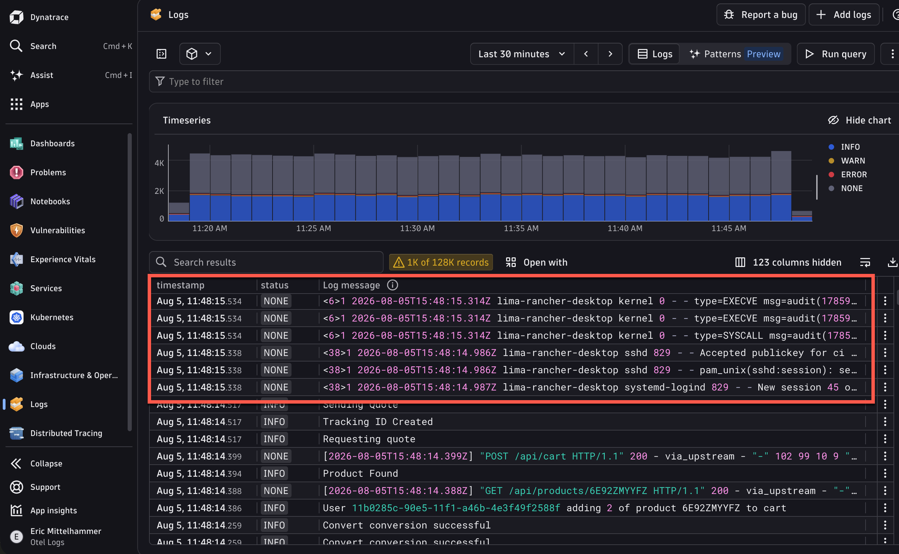
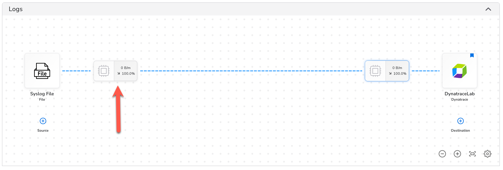
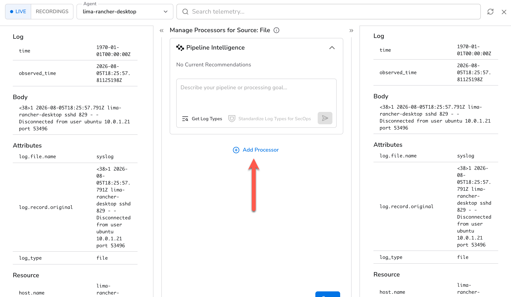
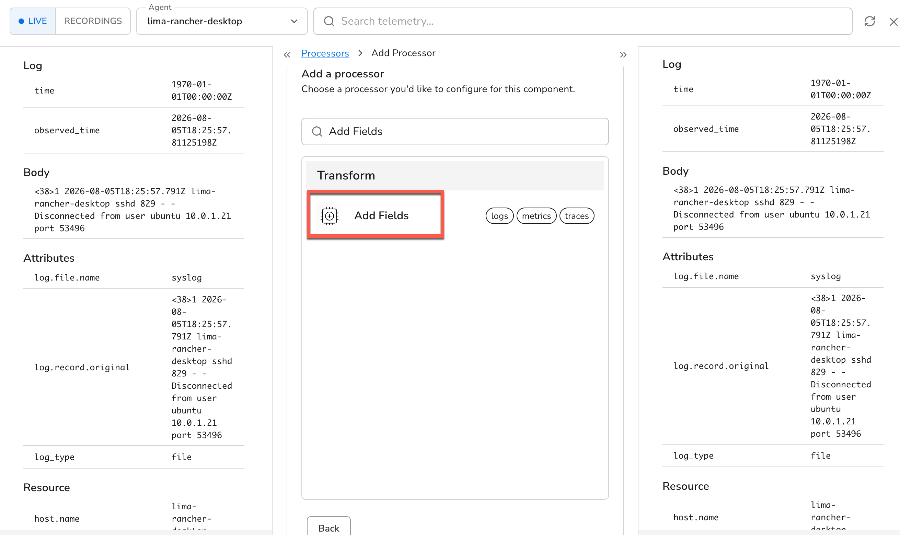
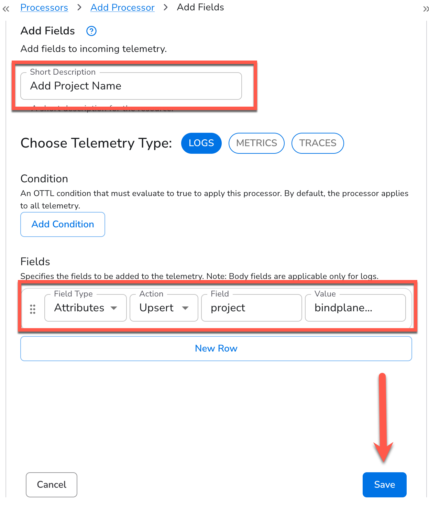
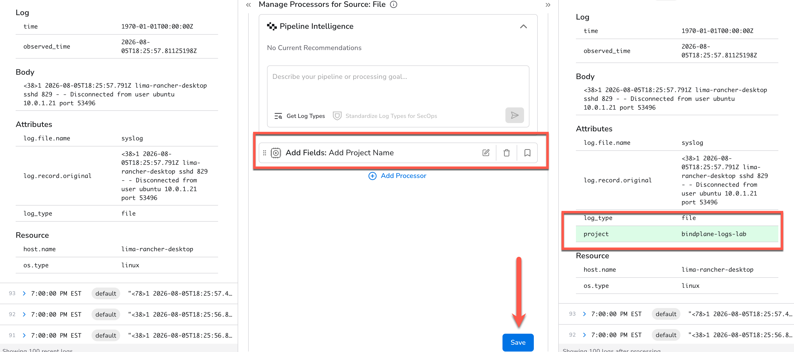
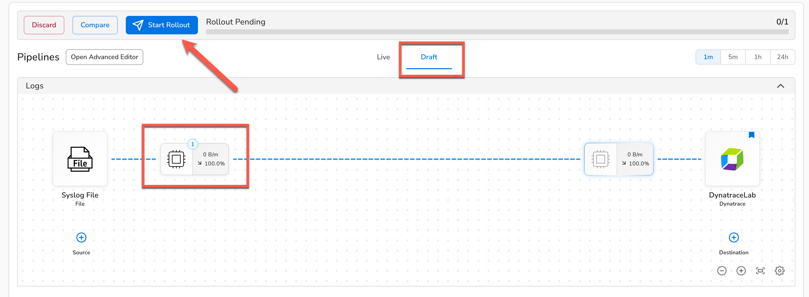
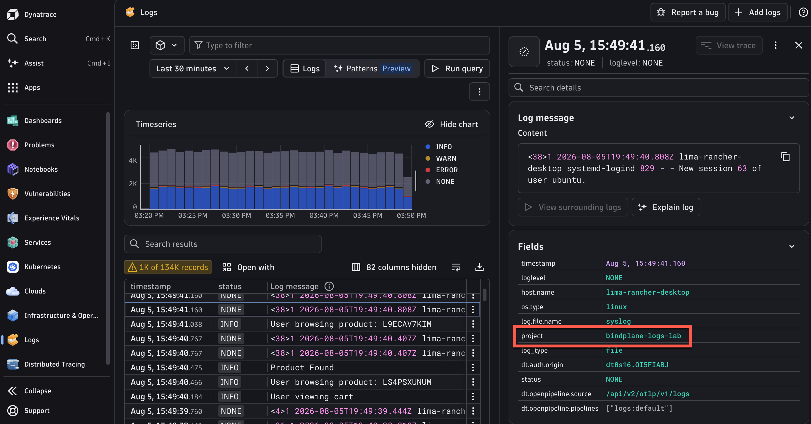
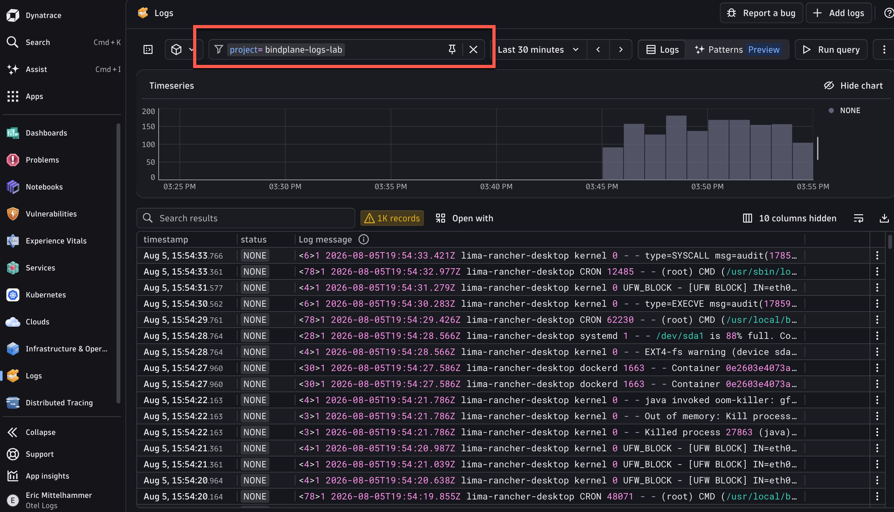

When your syslogs first start arriving in Dynatrace, they'll be mixed in with every other log source in your environment. To make them easier to work with, we'll add a custom attribute to identify them.

That's where **processors** come in. A Bindplane processor sits between your source and destination in the pipeline and transforms log records in-flight, before they leave your host. One of the simplest and most useful processors is **Add Fields**: it stamps a static key-value attribute onto every log record passing through, so the field is always present and always consistent.

Bindplane's live log preview makes this easy to reason about. Before you commit any changes, you can see exactly what a log record looks like *before* and *after* your processor is applied using actual live data from your agent. Once you're happy with what you see, a rollout pushes the updated configuration to the agent seamlessly.

In this section, you'll add a `project: bindplane-logs-lab` attribute to every log in your pipeline. This field will follow your logs into Dynatrace and become the key you use throughout the rest of the lab for filtering, routing in OpenPipeline, and building queries.

See our Syslogs in Dynatrace.  They're mixed in with everything else that is streaming in to our Dynatrace environment.

Let's use a Bindplane processor to help us sort this out.

### 1. Open the Processors Configuration
Beginning at you logs pipeline configuration, click on the processor configuration node for the Syslog file source.

### 2. View and Compare Live Logs
Here we can see a live preview of the logs that are passing through this node.  This will allow us to test and debug parsers with live data before we apply our changes!

Click on one of the incoming log messages on the left, and the corresponding outgoing log will automatically expand on the right.  (Of course, they will be identical, because we don't have any processors configured yet)

Click "Add Processor" and continue to the next step.

### 3. Find the "Add Fields" Transform Processor

Search for "Add Fields" in the search box, and find the result "Add Fields", which is a **Transform** type processor

Click on the processor name to begin configuring it.

### 4. Configure the Add Fields Processor
We are going to add a field to all logs used in this lab so that they are easily filterable in Dynatrace.

1. Add the Short Description "Add Project Name"
2. For the field itself, use `project` for the field name, and `bindplane-logs-lab` for the field value.   Keep the defaults for the other values.
!!! info "A Unified Telemetry Pipeline Built on OpenTelemetry"
    Because Bindplane manages OpenTelemetry components, our Add Field follows the [OpenTelemetry Specification](https://opentelemetry.io/docs/specs/otel/logs/data-model/#log-and-event-record-definition), which you may recognize.  We can change the field type to a Resource field, or the Body of the message altogther, as well as the attribute type we're adding here.  We can also choose how to modify the record: Insert, Update or Upsert.

3. Click "Save", and let's preview our changes

### 5. Preview Changes

Now we're back to our processor node configuration.  We can see that our processor has been added.  Expand one of the logs messages on the left.  We can see what our log message would look like if passed through this node, with our new field!

Notice as well that Bindplane has enriched our logs by adding some fields such as the `log_type` as well as some [OpenTelemetry Resource](https://opentelemetry.io/docs/concepts/resources/) attributes.

Click the "Save" button at the bottom.  We had previously saved our changes to the individual processor that we created.  This will save *all* changes made to this processor node (if we added or edited multiple processors, for example).

### 6. Rollout to the Agent
We're back at our configuration and we can see that our processor node is indicating that we have one processor now.  But also notice that we're prompted to "Start Rollout" and that we are currently viewing a draft version of our configuration.

Even though we've saved our changes to the configuration itself, the final step is to roll it out to the agents that use it (in our case, the single agent we added).

Go ahead and click "Start Rollout" to push this change to the agent.

!!! tip "Infrastructure as Code"
    Notice the "Compare" button next to "Start Rollout".  Clicking it will show you the underlying declarative YAML that is used to construct your configuration.

### 7. Filtering in Dynatrace
Once the rollout is complete, switch to your Dynatrace environment and click "Run Query" again to fetch the latest logs.

Click on one of the Syslog logs and see the detailed view on the right side of the window.  There's our added field!  Now we can use it to filter for any logs coming from this lab.

Add a filter to this view to see only our Bindplane Lab logs:

!!! tip "Dynatrace Segments"
    In Dynatrace, [Segments](https://docs.dynatrace.com/docs/manage/segments) allow you automatically filter the data you see across the platform, without having to explicity apply filters as you use it.
    Optional: create a segment for logs using the filter you applied above.

Perfect!  Now we can focus on exactly what we need to.  Think about how you'd use this feature with the logs you currently collect.

- [Add Structure with OpenPipeline:octicons-arrow-right-24:](6-parsing-with-openpipeline.md)

