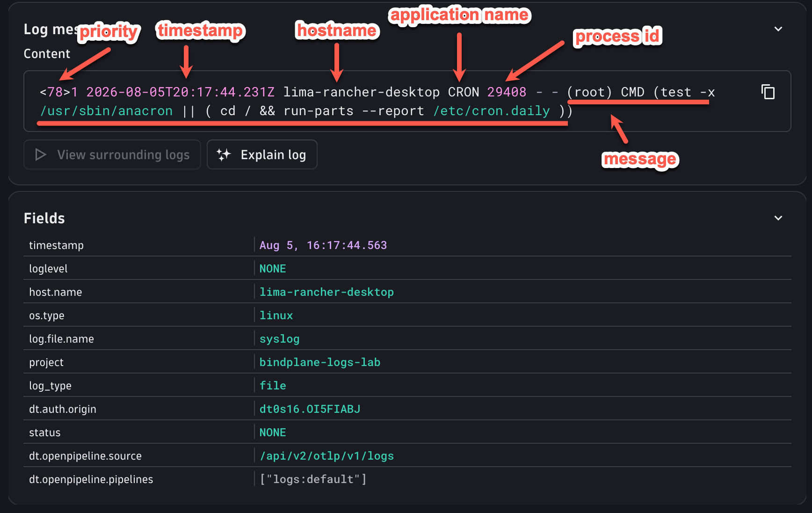
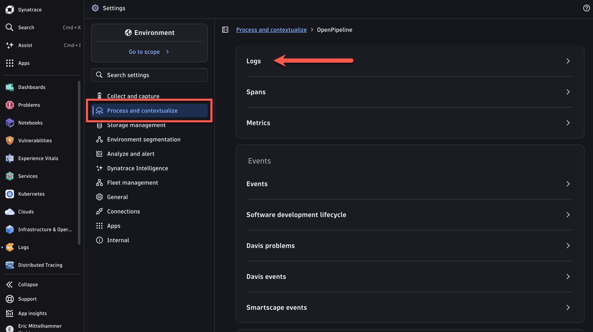
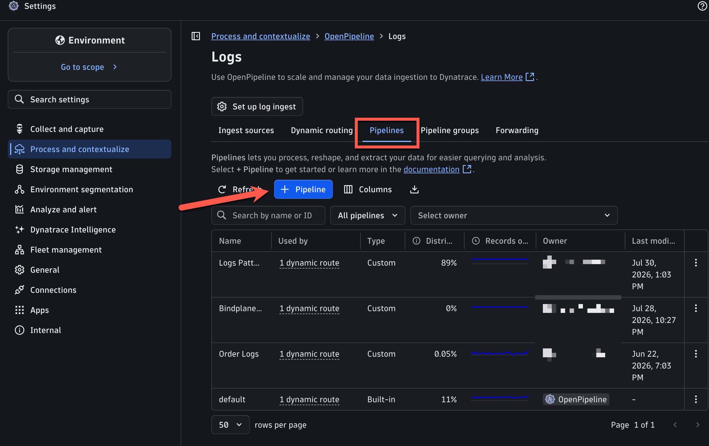
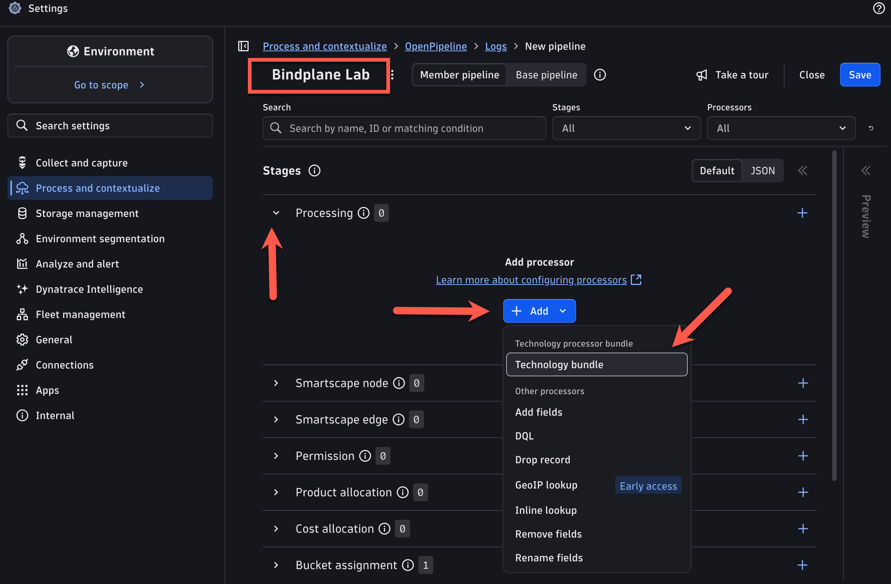
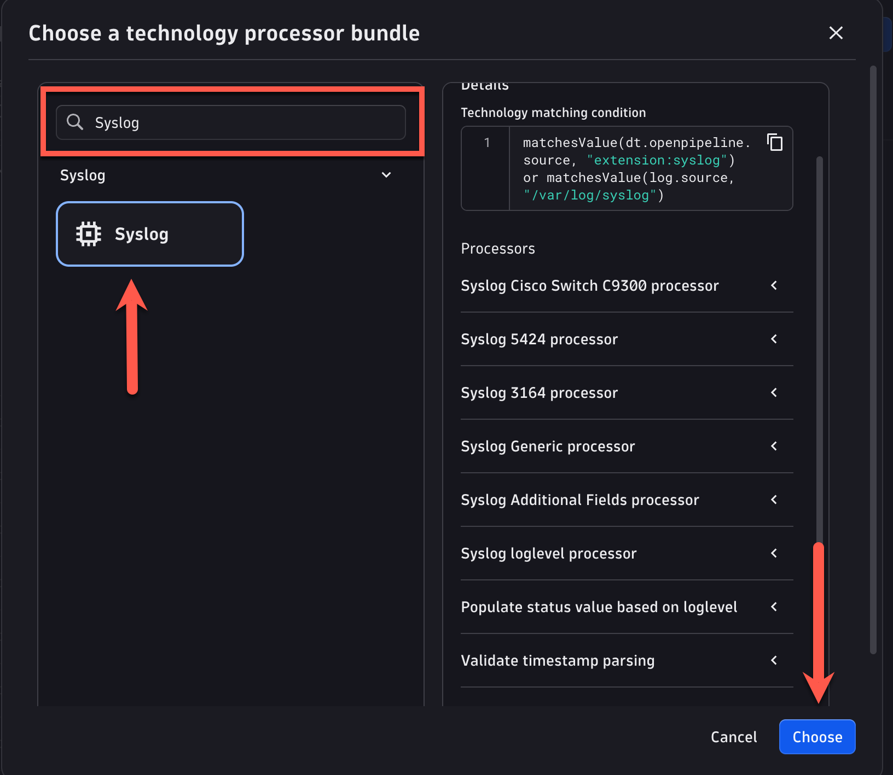
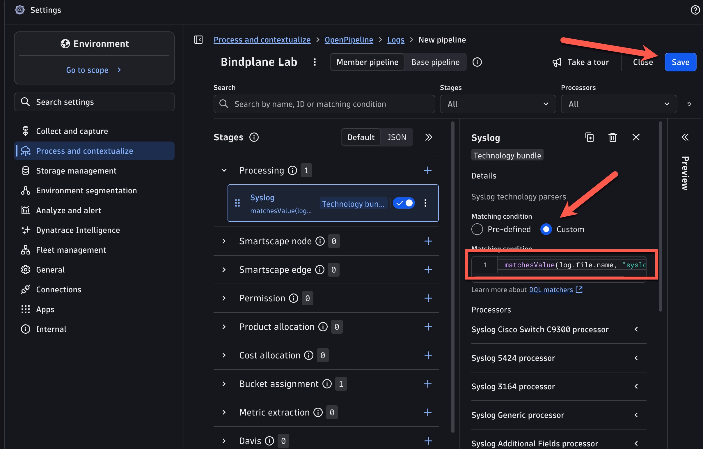
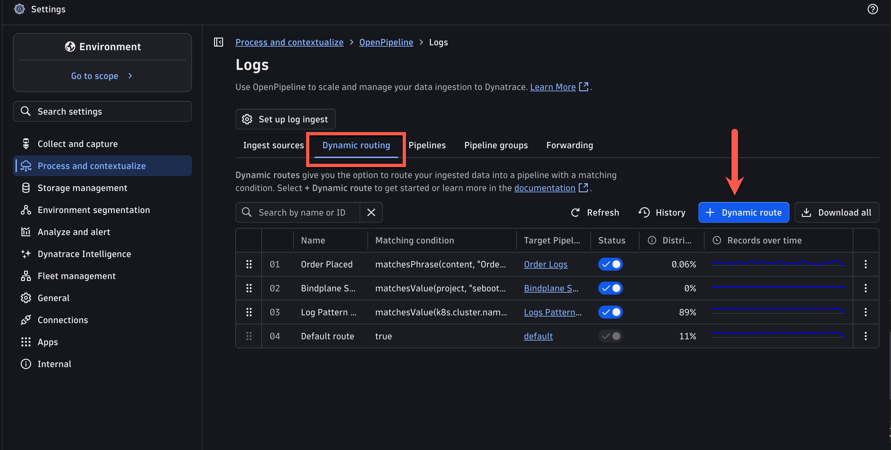
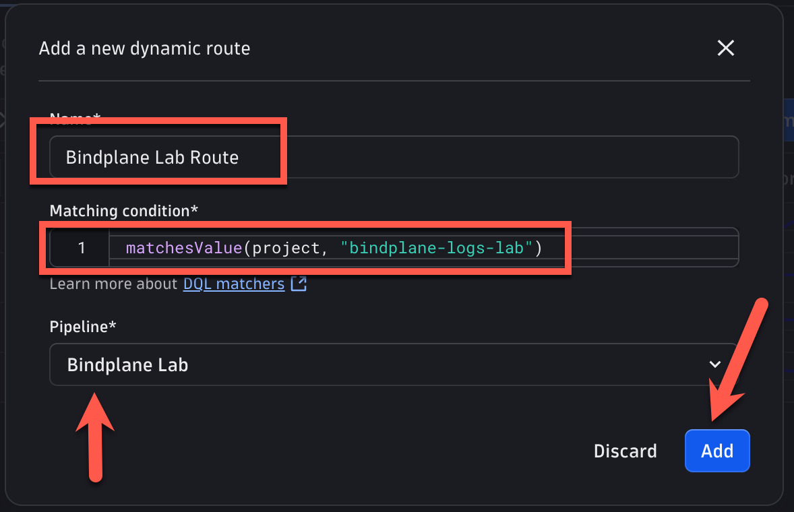
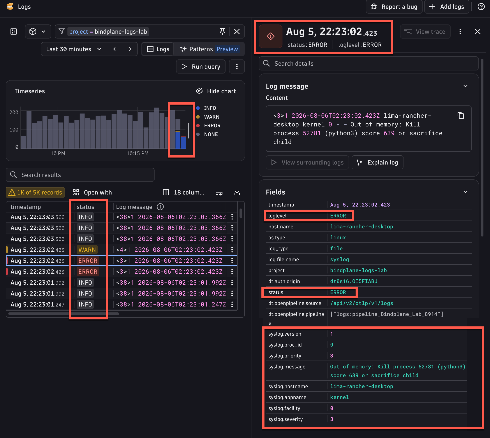

Your syslog records are now flowing into Dynatrace, but they arrive as a single flat string in the `content` field. All the rich metadata that the [Syslog RFC 5424](https://datatracker.ietf.org/doc/html/rfc5424) defines: priority, facility, severity, process ID, app name, etc is trapped inside that string, invisible to queries and filters. Every log also shows a status of `NONE` because there's no parsed severity level.

[OpenPipeline](https://docs.dynatrace.com/docs/platform/openpipeline)  is Dynatrace's server-side data processing engine. It receives your logs at ingest and applies a sequence of processors before storing them, so you can reshape data without touching the source or the collection agent. For common log formats like syslog, OpenPipeline includes **Technology Bundles**: pre-configured processor rules that already know how to parse the format and map fields to Dynatrace's Semantic Dictionary.

You'll connect your logs to the Syslog Technology Bundle via a **Dynamic Route**, a DQL-based matching condition that tells OpenPipeline which pipeline to send specific records through. The `project` field you added in the previous section is exactly what you'll use as that routing key: logs tagged `bindplane-logs-lab` go through your new pipeline, everything else is unaffected.

After this section, your syslog records will have properly structured fields, correct severity levels, and far more queryable context.


### 1. Understanding Syslog
Even though we've got some great contextual information in our logs, there is more we can extract from them.  The [Syslog specification](https://datatracker.ietf.org/doc/html/rfc5424) declares additional metadata in addition to the actual log message.  But all of that context is trapped inside our `content` field as a string.  Here's what we're missing out on:



Also notice that all of our logs have a status of `NONE` because there was no included status or level field.

### 2. Creating a Pipeline to Parse logs
Were going to create a pipeline that will automatically parse our Syslog-formatted logs, pulling valuable context into separate fields, so we can query, filter, sort, etc.

In Dynatrace, navigate to your Environment Settings, or search for "OpenPipeline", then:

1. Click "Process and Contextualize"
2. Click "Logs"




This will take you to the main configuration for OpenPipeline.

1. Click on the "Pipelines" tab, showing you all of your pipelines
2. Click on the "+ Pipeline" Button



### 3. Creating a Processor
Similarly to Bindplane, OpenPipeline uses [Processors](https://docs.dynatrace.com/docs/platform/openpipeline/concepts/processing) to reshape and enrich data.  We're going to add a processor to our pipeline that will do the parsing and assignment of fields from our Syslog-formatted logs.  Dynatrace makes this possible with pre-configured [Technology Bundles](https://docs.dynatrace.com/docs/analyze-explore-automate/logs/lma-log-processing/lma-tech-bundles-processors)

!!! info "Technology Bundles"
    Technology bundles normalize diverse log formats into consistent attributes aligned with the Semantic Dictionary, automatically extract key fields, and enable immediate DQL enrichment, searching, and alerting for faster troubleshooting, reliable analytics, and improved data quality.

1. Choose a descriptive name for your Pipeline, like "Bindplane Lab"
2. Expand the Processors drawer by clicking on the chevron
3. Click the "+ Add" Button
4. Choose "Technology Bundle"



On the following dialog,

1. Search for "Syslog"
2. Click on the Syslog button
3. Click "Choose"



Normally, this Processor would be ready to go as-is, but we have some special circumstances.  Luckily OpenPipeline is flexible and configurable and can accommodate our situation.

Processors in OpenPipeline use a [matching condition](https://docs.dynatrace.com/docs/platform/openpipeline/reference/dql/dql-matcher-in-openpipeline) to test whether or not they should be applied to each log message that passes through the pipeline.

It's a common convention to write syslog messages to `/var/log/syslog`, so the default matching condition is written as (with additional support for logs that are sent via Dynatrace's syslog extension):

```
matchesValue(dt.openpipeline.source, "extension:syslog") or matchesValue(log.source, "/var/log/syslog")
```
You may recall that our syslog messages aren't written to `/var/log/syslog`.  In fact, we don't even have a field available to us named `log.source`.

Can you think of a field that we can use instead?  Maybe open a new browser tab and inspect our logs for a field that serves the same purpose.

??? tip "Hint"
    Our logs have a field named `log.file.name`, and its value is "syslog".

Switch the Matching Condition to a custom one, and use the following condition:
```
matchesValue(log.file.name, "syslog")
```



Finally, click "Save" to save the overall pipeline configuration.

### Create a Dynamic Route
Our processor is all set up, but it's not actually going to do anything, because no logs are being sent through our pipeline.  OpenPipeline uses [Dynamic Routes](https://docs.dynatrace.com/docs/platform/openpipeline/get-started/how-to-routing) to facilitate this. Similarly to the Matching Conditions for a Processor, Dynamic Routes use matching conditions to route data coming into your environment to a particular pipeline.

We want to send all the logs from our Dev Container to the pipeline that we just created.  Can you think of a matching condition that would achieve that?

??? tip "Hint"
    Remember the Bindplane processor that we used to add a field to all of the logs in our pipeline?  That field was named `project` and its value is `bindplane-logs-lab` (or whatever you chose at the time)

Return to the OpenPipeline Logs settings page

1. This time, select the "Dynamic Routing" tab
2. Click "+ Dynamic Route"



On the dialog:

1. Choose a descriptive name for this route
2. Enter the matching condition for the field we added in Bindplane:  `matchesValue(project, "bindplane-logs-lab")`
3. Choose the Pipeline that we just created
4. Click "Add"



Confirm that you want to save your changes to the table.

### 5. Verify Parsed Syslog 

Return to the logs app in Dynatrace an click "Run Query" to retrieve the latest logs.  Click on one of them to view detail.  Notice how much more context we have!  Just from adding a single processor.



<div class="grid cards" markdown>
- [Masking Sensitive Data and Routing:octicons-arrow-right-24:](7-masking-routing.md)
</div>
