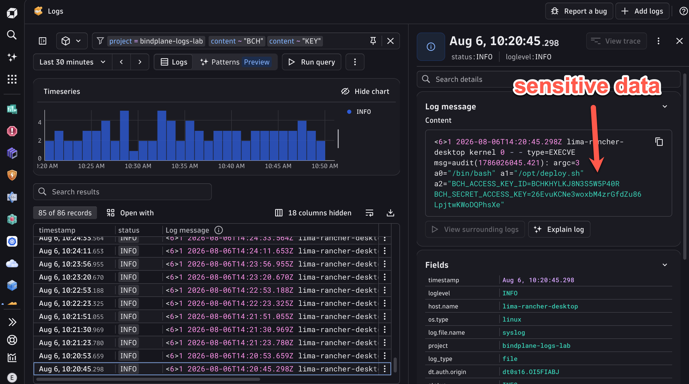
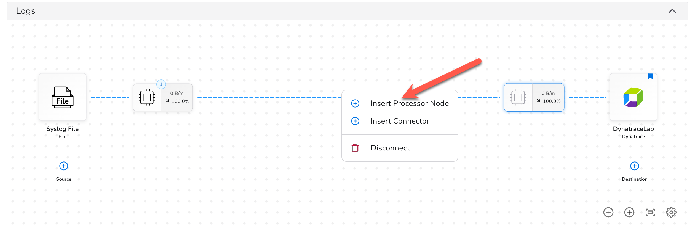
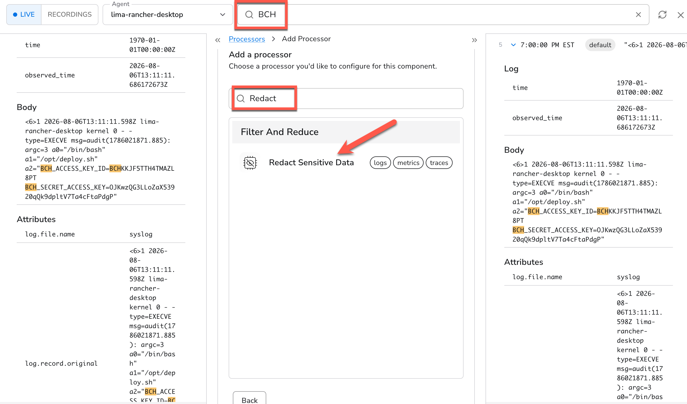
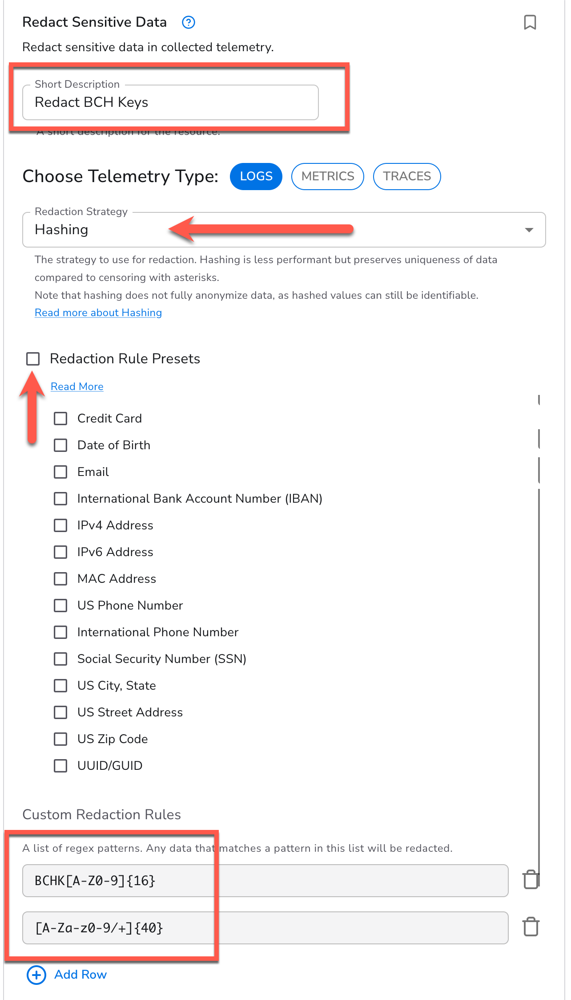
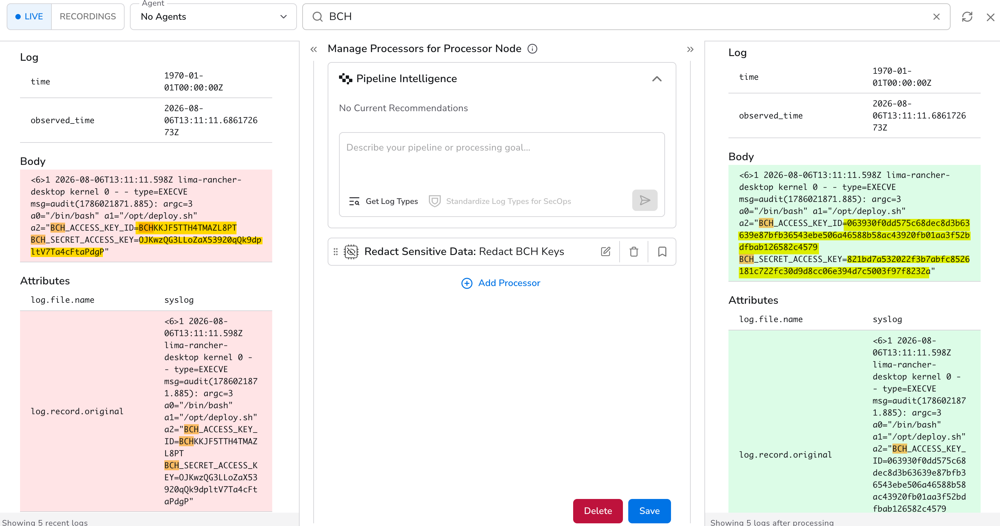
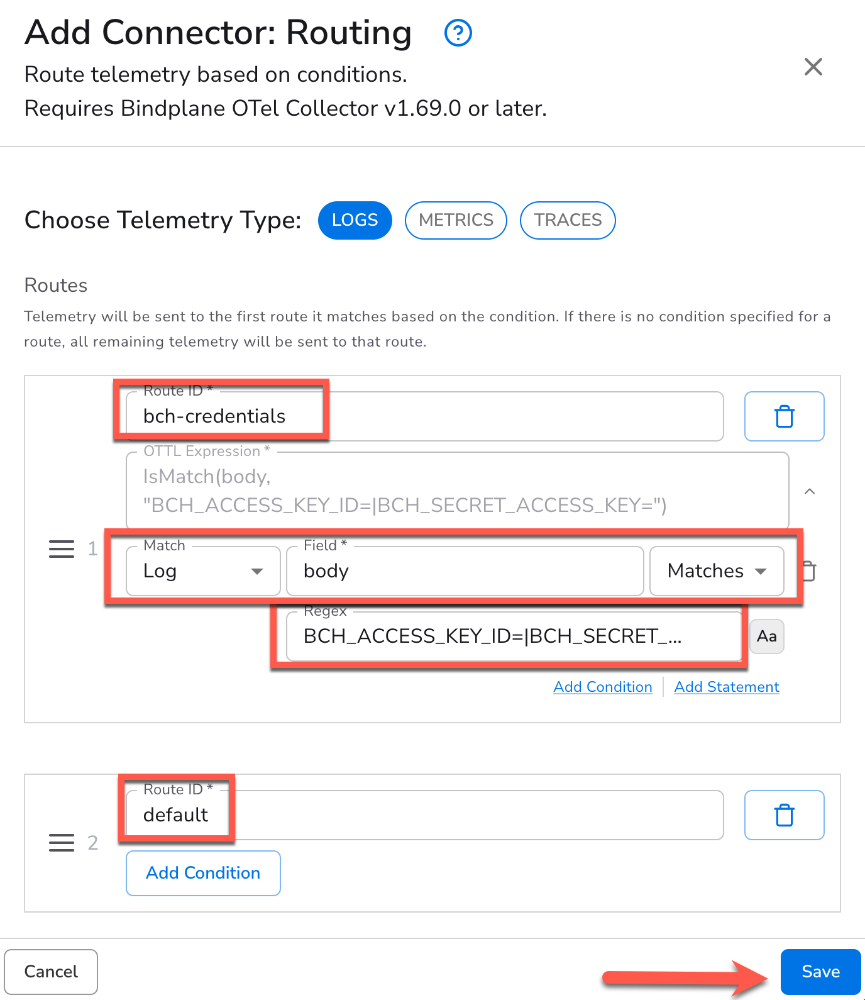
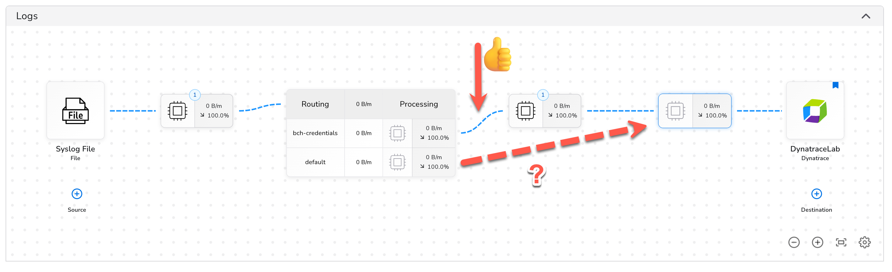
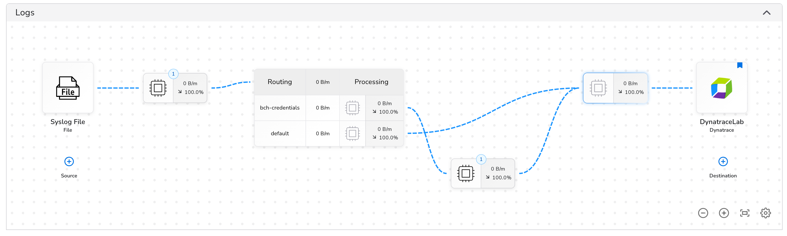
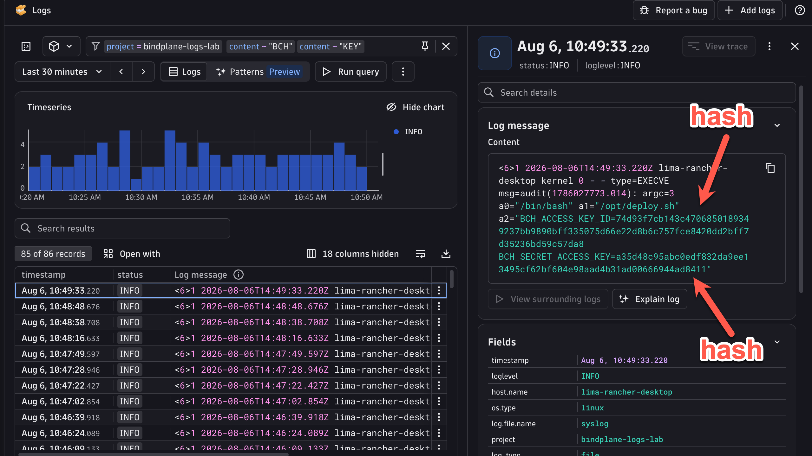

## Masking Data & Routing

Uh oh.  You were sitting in on a meeting and you heard one of the DevOps engineers mention that they wrote a script that manages cloud infrastructure from one of the hosts in your network (your Dev Container!).  This can't be good.

You know that the `auditd` system logs every command that was run on the system.  There's a real possibility of a credential leak here.  Let's investigate.

!!! warning "Example Credentials"
    All logs in the lab, including the ones in this exercise are randomly and synthetically generated.

This is a realistic and common scenario. Infrastructure automation scripts frequently use environment variables or command-line arguments that get captured by `auditd` or similar system loggers. The credentials themselves are synthetically generated for this lab, but the pattern is real.

The right fix is to prevent the sensitive data from ever leaving your infrastructure. Bindplane's **Redact Sensitive Data** processor lets you define regex patterns that match sensitive values and replace them, in this case using a **hashing** strategy. Hashing is preferable to blank redaction here because it preserves uniqueness: if the same credential appears in multiple log records, they'll all produce the same hash, which means you can still assess the scope of the leak without ever exposing the raw value.


Let's look through our logs for any credentials for our vendor, **Big Cloud Hyperscaler**.

Head back to the Logs app in Dynatrace and filter for the terms "BCH" and "KEY" in our log messages.



As we suspected, credentials in plain text in our logs.  The quickest way to mitigate this is to prevent that data from leaving our infrastructure.

Let's use Bindplane to mask the sensitive data.  Navigate to your Bindplane Configuration so we can make these changes.

### 1. Create a New Processor Node
*Spoiler alert: We're looking a bit into the future here.  Normally you could just add the masking processor to one of your existing Processor Nodes.  But for the purposes of the Lab, we're going to pre-optimize for what we know is coming and create an additional one.*

Click on the pencil icon in the connection between your existing Processor Nodes, and select "Insert Processor Node"



Then click "Start Rollout" so we can actually send our logs through it.


### 2. Mask Sensitive Data

Now we're going to use Bindplane's [Redact Sensitive Data Processor](https://docs.bindplane.com/integrations/processors/redact-sensitive-data) to mask the credentials.

After the rollout is complete, click on the new node so we can add the processor.

1. Search for "BCH" in the search bar so we can narrow our focus to the offending logs
2. Search for the "Redact Sensitive Data" processor in the list
3. Select it when it surfaces



Our strategy for redaction will be:
- we want to keep as much of the original log message intact as possible, we only want to redact the actual sensitive data
- we are going to use a **hashing** strategy.  This way, only non-sensitive hashes are exposed, but they are one-way mappable back to our exposed credentials.  Internally, we can make an assessment of which credentials were exposed.

!!! tip "Credential Regex"
    - The BCH access key takes the form of the string "BCHK" followed by 16 alpha numeric upper case characters.  The regex for that is:  `BCHK[A-Z0-9]{16}`
    - The secret access key is simply a 40 character mixed-case string.  `[A-Za-z0-9/+]{40}`

1. Create a descriptive name for this processor
2. Change the Redaction Strategy to "Hashing"
3. Uncheck "Redaction Rule Presets".  Although this is very useful and convenient, we'll just focus on our immediate issue for now
4. Create two custom rules for the two credentials we want to redact.  Enter the regular expressions that match them
5. Click "Save" at the bottom of that dialog so we can preview our changes



Success!!!  Our sensitive credentials have been replaced with hashed strings, and the rest of our log message remains intact, so we can still work with them in full detail.



Click "Save" at the bottom to save changes to the processor and return to our pipeline config.

### 3. Routing Data Selectively

Wait a second.  We are sending *all* logs through our processor.  Is it possible that our regex could match some other data that has a similar format, but *isn't* a credential?

**Don't roll out the changes just yet!**

We can narrow down our redaction to specific logs using [Routing](https://docs.bindplane.com/integrations/connectors/routing).  Similar to the Dynamic Route we created in OpenPipeline, we can inspect our logs and route them through our pipeline.

Begin by clicking the pencil icon between the first Processing Node coming out of the Syslog source and the new one we just created.

Choose "Insert Connector", and then choose "Routing"

Here is where we will create our routing logic.  The Router uses [OTTL](https://github.com/open-telemetry/opentelemetry-collector-contrib/blob/main/pkg/ottl/README.md) conditions to match the log messages and then route them appropriately.

The routes are evaluated in order, and the first match wins.  So we want to place our most specific rules at the top, and our general "catch-all" rules at the bottom.

Let's create two routes - one that will match our credential-exposed logs, and then a "default" route to match everything else.

!!! tip "OTTL IsMatch"
    The input to the router can take any OTTL expression, but the [IsMatch](https://github.com/open-telemetry/opentelemetry-collector-contrib/blob/main/pkg/ottl/ottlfuncs/README.md#ismatch) function is a great candidate for this.

Can you think of a good way to filter for only logs that contain our sensitive credentials?

Let's target logs that contain the key names for our credentials:

```
IsMatch(body, "BCH_ACCESS_KEY_ID=|BCH_SECRET_ACCESS_KEY=")
```

This will match the `body` field against the regular expression provided as the second argument.

But the UI will help you write OTTL conditions!

1. Identify the first route indicating that it is for logs containing the credentials "bch-credentials"
2. Choose to match the Log, choose the "body" field, and then choose "Matches"
3. Enter the regular expression `BCH_ACCESS_KEY_ID=|BCH_SECRET_ACCESS_KEY=`
4. Name the second route "default" and don't create any conditions
5. Click "Save"



### 4. Connect the Routes

Now we just need to wire everything up to route our data effectively.

Once you Save the Routing node, you'll see it inserted into your pipeline.  The default connection should connect the `bch-credentials` route to the New Processor Node containing the Redaction Processor.  Handy! That's what we want.  Now all we have to do is route `default` around the new processor to keep them flowing.



Now just click on the plus "+" icon on the right side of the `default` route, and then click on the Processor Node that feeds into the Dynatrace Destination.



Click "Start Rollout" to apply changes.

### 5. Verify in Dynatrace

Head back over to Dynatrace and have a look at one of the most recent logs.

Success!  Now we see hashed values instead of our sensitive credentials!



Let's assess the impact of this leak.

<div class="grid cards" markdown>
- [Extracting Metrics from Logs:octicons-arrow-right-24:](8-metric-extraction.md)
</div>
