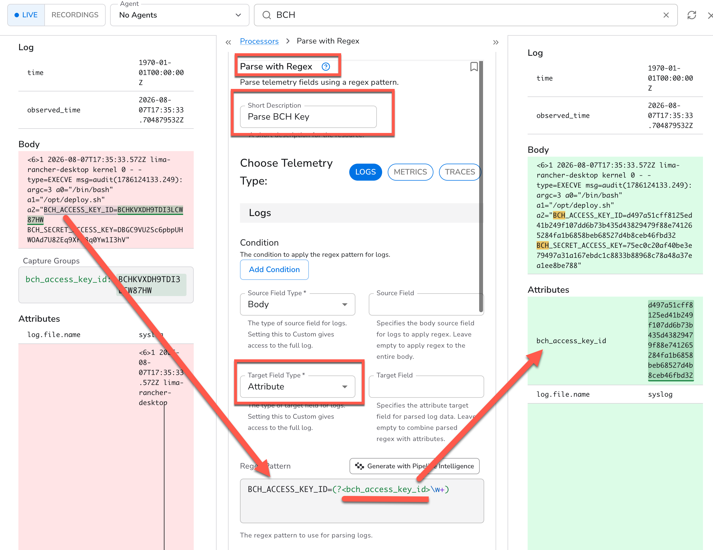
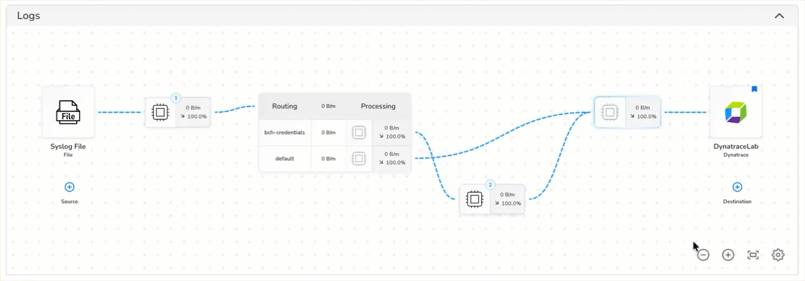
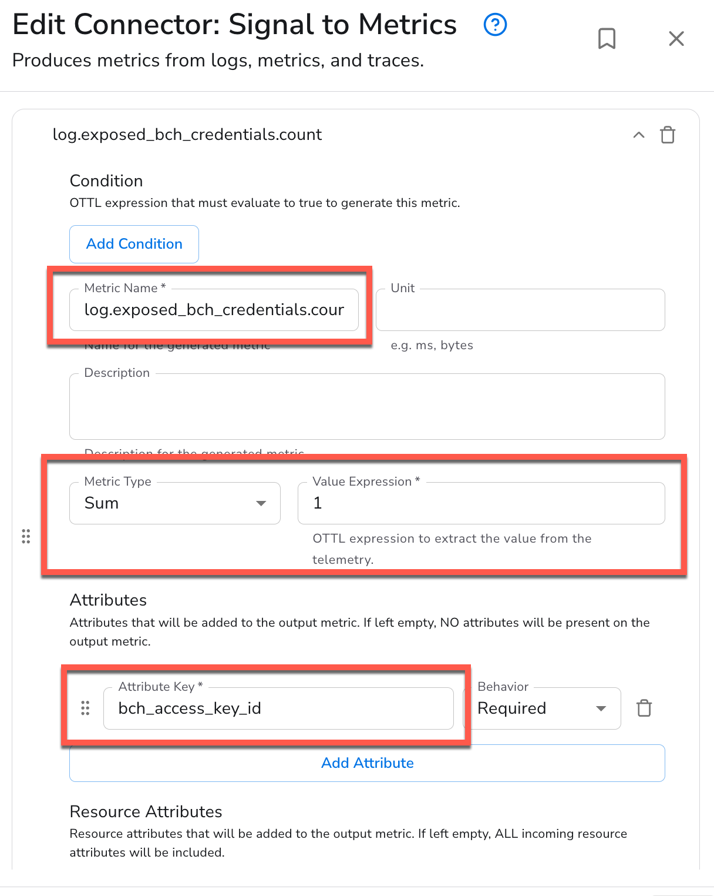
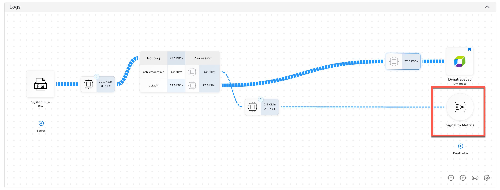
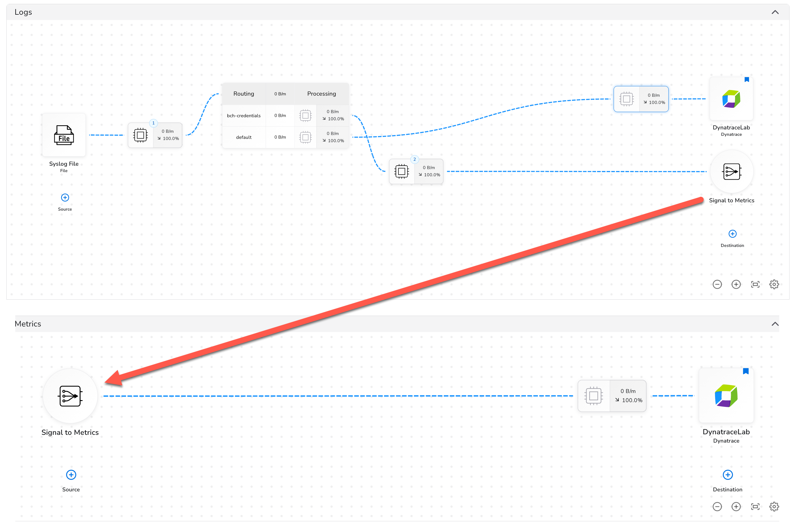
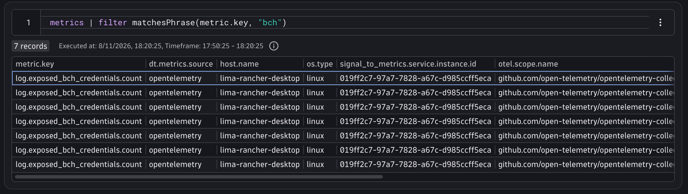
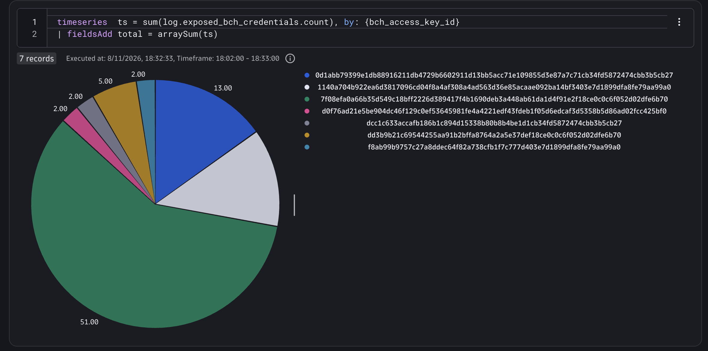

The credential leak is contained, but leadership wants an impact assessment: how many distinct credentials were exposed, and how often did each one appear in the logs?

You already have everything you need to answer that, but repeatedly querying logs to answer a time-based question ("how many per hour over the last week?") is expensive and slow. The right tool for this is a **metric**.

Bindplane's **Signal to Metric** connector lets you derive a proper time-series metric directly from your log pipeline. For each log record that matches your credential pattern, it emits a counter increment labeled with the specific credential key that was exposed. Those metric data points flow through your pipeline's **Metrics Pipeline** and land in Dynatrace just like any other metric, ready for `timeseries` queries, charts, and alerting.

Because the redaction processor runs before the metric extraction in this pipeline, you'll be parsing the *hashed* credential value, not the original. That means your metric dimensions are safe to store, but still individually identifiable: you can hash your known credentials offline and compare the hashes to see exactly which ones were leaked.

### 1. Parse the Credential Key

We're going to want to find out how many different sets of credentials were leaked, and how often.
Let's add a processor to the same node we used to redact the sensitive information.

1. Click "Add Processor".  Make sure to add the new processor after the Redaction one.  Processors are executed from top to bottom and we want to parse the redacted value, not the original one.
2. Find the Processor named "Parse with Regex" and select it.
3. Create a name for the new Proccesor
4. Beacuse we have already routed the logs, we know that only the logs we are targeting will ever pass through this processor, so no need for a condition.
5. For "Target Field Type", select "Attribute".  This means we want to add a new attribute field as a peer to the log body, not modify the body itself.
6. Leave target field blank - this will allow us to name the field inside of our regular expression (useful for parsing multiple fields at once)
7. Enter this regular expression: `BCH_ACCESS_KEY_ID=(?<bch_access_key_id>\w+)` it will match the key name and then capture the next string of word characters (`\w+`) after the equals sign. Whatever we place between `<` and `>` will become the attribute name.

You should see that the regular expression matches the key name.  Click "Save" and you'll see a preview of the extracted field on the right.



Save the changes to your processor and then rollout your changes to the agent.

### 2. Create a Metric

To create a metric from logs, we'll use a "Signal to Metric" connector.

In the output of the processor we just created, click on the pencil icon, create a connector, and then choose "Signal to Metric"



Once the dialog for the connector opens, edit the configuration:

1. Create the Metric Name `log.exposed_bch_credentials.count`
2. Select "Sum" for the Metric Type and leave the value as 1.  This will count 1 for every occurrence of our log.
3. Add the attribute from our log for the key that we masked `bch_access_key_id`.  This will add a dimension to the metric that we can split or summarize by.
4. Click "Save" to create it.




### Metrics Pipeline

Once your connector is created, you'll notice the layout of your pipeline has changed, and your connector doesn't sit exactly between the processor and the output.



This is beacuse we are now emitting a new telemetry type, Metrics, from our pipeline.  At this point, Bindplane will automatically route the Metrics coming out the this connector into our **Metrics Pipeline**.

The Metrics Pipeline is just below the logs piplin in the UI. Scroll down and expand it by clicking on the chevron.  

**Rollout the changes** and you'll see that the new Metric we created is flowing through this pipeline and to our Dynatrace destination.




### Exploring and Using Metrics

Now let's head over to Dynatrace to explore the new Metric.

1. Create a new [Notebook](https://docs.dynatrace.com/docs/analyze-explore-automate/dashboards-and-notebooks/notebooks) where you'll be able to run some queries.
2. Create a new Section of DQL type.

DQL has a command named [`metrics`](https://docs.dynatrace.com/docs/platform/grail/dynatrace-query-language/commands/metric-commands#metrics) that allows you to explore the presence and structure of the metrics, rather than charting or calculating them.

Use the following query to see if the metric you created is being ingested:
```
metrics | filter matchesPhrase(metric.key, "bch")
```
The results should show a permutation of that metric key for each of the exposed credential attribute values.



Now let's do something useful with that data.  We want to find out how many sets of credentials were exposed. For that, we can use the [`timeseries`](https://docs.dynatrace.com/docs/platform/grail/dynatrace-query-language/commands/metric-commands#timeseries) command, which will return a series of values for the metric key we specify.

Write a DQL query that will show how many sets of credentials are exposed.

??? Hint "Timeseries Summarization"
    The straightforward way to use a timeseries is simply to plot the a line chart for each series split with the `by:` paramter:
    ```
    timeseries total = sum(log.exposed_bch_credentials.count), by: {bch_access_key_id}
    ``` 
    But with DQL, we can summarize even further - say, if we wanted to see a *total* of all of the values within the query timeframe:
    ```
    timeseries ts = sum(log.exposed_bch_credentials.count), by: {bch_access_key_id}
        | fieldsAdd total = arraySum(ts)
    ```

Run your query and inspect the results.



Now we can hash all of our credentials securely offline, and compare them to the values here to see which ones have been leaked!

<div class="grid cards" markdown>
- [Bindplane Health:octicons-arrow-right-24:](9-bindplane-health.md)
</div>